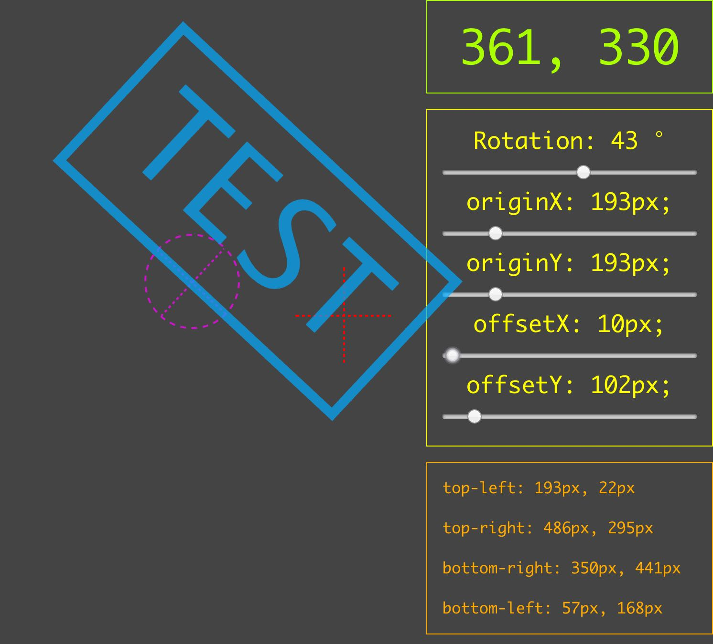

# CSS Transformed Corner Positions

How to get the corner positions of a DIV that has been transformed with CSS. For example:

```css
#box {
	transform: rotateX(90deg) translateY(100px);
	transform-origin: 30px 30px;
}
```
**Demo:** https://f1lt3r.github.io/css-transformed-corner-positions/test.html


[](https://www.youtube.com/watch?v=QfX86jkGFQk)
[https://www.youtube.com/watch?v=QfX86jkGFQk](https://www.youtube.com/watch?v=QfX86jkGFQk)

## The Math

1. Get the offset from the original position to the origin point (rotation point: x2 y2)
1. Get the angle between the origin point and the corner you are querying (x1, y1)
1. Combine the angle between corner and origin to the angle that the element is rotated by
1. Get the distance between the origin point and the corner you are querying (x1, y1)
1. Multiply the combined angles by the distance from the origin to get the corner position after the rotation

## The Code

```javascript
const getCorner = name => {
	let x1
	let y1

	const rot = radians(rotation)

	const x2 = rect.left + originX
	const y2 = rect.top + originY

	if (name === 'top-left') {
		x1 = rect.left
		y1 = rect.top
	}

	if (name === 'top-right') {
		x1 = rect.right
		y1 = rect.top
	}

	if (name === 'bottom-right') {
		x1 = rect.right
		y1 = rect.bottom
	}

	if (name === 'bottom-left') {
		x1 = rect.left
		y1 = rect.bottom
	}

	const ang = angle(y2, y1, x2, x1) + rot
	const dst = dist(y2, y1, x2, x1)
	const x = offsetX + Math.round(x2 - (Math.cos(ang) * dst))
	const y = offsetY + Math.round(y2 - (Math.sin(ang) * dst))

	return `${x}px, ${y}px`
}
```

## The Reason

To get the corner positions of a DOM element we can usually rely on JavaScript using the `elemen.getBoundingClientRect()` function. Although this function takes into account transformations when calculating new widths and heights, it does not provide a way to understand the locations of the corners.

For example: in my imaginary program, I would like to draw certain glyphs at particular corners, regardless of the rotation, and rather than hack together a DOM solution with container DIVs that control a lot of CSS, I want to use some simple Math to understand where the corners are after applying the CSS transform to one element.
